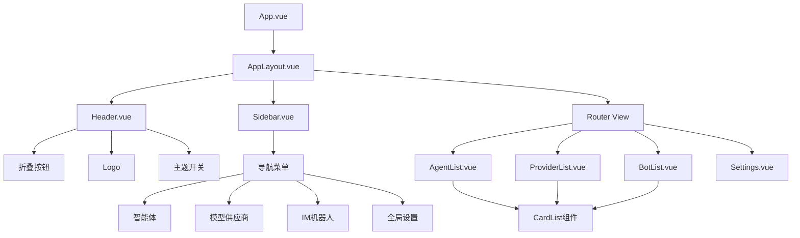
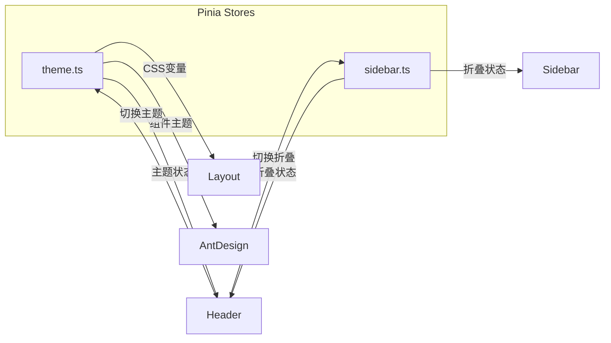

# BeepBot Dashboard 前端布局规划

## 一、需求概述

实现 BeepBot 控制台前端的基础布局，采用扁平化卡片风格，支持深浅色主题切换。

### 技术选型
- **框架**: Vue 3.5+ (Composition API)
- **UI 组件库**: Ant Design Vue 4.x
- **构建工具**: Vite 7
- **状态管理**: Pinia 3
- **路由**: Vue Router 5
- **语言**: TypeScript 5.9

---

## 二、页面布局结构

```
┌─────────────────────────────────────────────────────────────────┐
│  Header                                                         │
│  ┌──────┬─────────────────────────────────────┬──────────────┐ │
│  │ ☰    │ BeepBot Logo                        │ 🌙 深浅色开关 │ │
│  │折叠  │                                      │              │ │
│  └──────┴─────────────────────────────────────┴──────────────┘ │
├────────────┬────────────────────────────────────────────────────┤
│            │                                                    │
│  Sidebar   │                    Main Content                   │
│            │                                                    │
│  ┌──────┐  │  ┌─────────────────────────────────────────────┐  │
│  │ 🤖   │  │  │                                             │  │
│  │智能体│  │  │              路由页面内容                     │  │
│  └──────┘  │  │                                             │  │
│            │  │              - 智能体列表                    │  │
│  ┌──────┐  │  │              - 模型供应商列表                │  │
│  │ 🔌   │  │  │              - IM机器人列表                  │  │
│  │供应商│  │  │              - 全局设置                      │  │
│  └──────┘  │  │                                             │  │
│            │  │                                             │  │
│  ┌──────┐  │  │                                             │  │
│  │ 💬   │  │  │                                             │  │
│  │机器人│  │  │                                             │  │
│  └──────┘  │  │                                             │  │
│            │  │                                             │  │
│  ┌──────┐  │  │                                             │  │
│  │ ⚙️   │  │  │                                             │  │
│  │设置  │  │  │                                             │  │
│  └──────┘  │  └─────────────────────────────────────────────┘  │
│            │                                                    │
└────────────┴────────────────────────────────────────────────────┘
```

### 布局说明

#### 1. Header 头部栏
- **高度**: 64px
- **内容**:
  - 左侧: 折叠按钮（汉堡菜单图标）+ Logo 文字 "BeepBot"
  - 右侧: 深浅色主题切换开关
- **样式**: 固定顶部，带底部边框

#### 2. Sidebar 侧边导航栏
- **宽度**: 
  - 展开状态: 200px
  - 折叠状态: 64px（仅显示图标）
- **导航项**:
  1. 智能体 (图标: RobotOutlined)
  2. 模型供应商 (图标: ApiOutlined)
  3. IM机器人 (图标: MessageOutlined)
  4. 全局设置 (图标: SettingOutlined)
- **样式**: 
  - 扁平化设计
  - 选中项高亮
  - 支持 hover 效果

#### 3. Main Content 主内容区
- **布局**: 自适应宽度，padding 24px
- **背景色**: 根据主题自动切换
- **内容**: 路由页面组件

---

## 三、主题系统

### 深浅色配色方案

#### 浅色主题 (Light)
```css
--bg-color: #ffffff           /* 页面背景 */
--header-bg: #ffffff          /* 头部背景 */
--sidebar-bg: #ffffff         /* 侧边栏背景 */
--text-color: #1f1f1f        /* 主文字颜色 */
--text-secondary: #666666    /* 次要文字 */
--border-color: #e8e8e8       /* 边框颜色 */
--card-bg: #ffffff            /* 卡片背景 */
--card-shadow: 0 2px 8px rgba(0,0,0,0.08)  /* 卡片阴影 */
```

#### 深色主题 (Dark)
```css
--bg-color: #141414           /* 页面背景 */
--header-bg: #1f1f1f          /* 头部背景 */
--sidebar-bg: #1f1f1f         /* 侧边栏背景 */
--text-color: #ffffff        /* 主文字颜色 */
--text-secondary: #a0a0a0    /* 次要文字 */
--border-color: #303030       /* 边框颜色 */
--card-bg: #1f1f1f            /* 卡片背景 */
--card-shadow: 0 2px 8px rgba(0,0,0,0.3)  /* 卡片阴影 */
```

### 主题切换实现
- 使用 Pinia Store 管理主题状态
- 使用 CSS 变量实现主题切换
- 主题偏好保存到 localStorage
- Ant Design Vue 组件主题自动跟随

---

## 四、卡片列表页面模板

### 列表页面结构

```
┌─────────────────────────────────────────────────────────────────┐
│  Page Header                                                     │
│  ┌─────────────────────────────────────────────────────────────┐│
│  │ 页面标题                              [+ 新建] 按钮         ││
│  └─────────────────────────────────────────────────────────────┘│
├─────────────────────────────────────────────────────────────────┤
│  Card Grid                                                       │
│  ┌──────────────┐ ┌──────────────┐ ┌──────────────┐            │
│  │ 卡片标题      │ │ 卡片标题      │ │ 卡片标题      │            │
│  │              │ │              │ │              │            │
│  │ 卡片描述内容  │ │ 卡片描述内容  │ │ 卡片描述内容  │            │
│  │              │ │              │ │              │            │
│  │ [操作按钮]   │ │ [操作按钮]   │ │ [操作按钮]   │            │
│  └──────────────┘ └──────────────┘ └──────────────┘            │
│                                                                  │
│  ┌──────────────┐ ┌──────────────┐ ┌──────────────┐            │
│  │ 卡片标题      │ │ 卡片标题      │ │ 卡片标题      │            │
│  │              │ │              │ │              │            │
│  │ 卡片描述内容  │ │ 卡片描述内容  │ │ 卡片描述内容  │            │
│  │              │ │              │ │              │            │
│  │ [操作按钮]   │ │ [操作按钮]   │ │ [操作按钮]   │            │
│  └──────────────┘ └──────────────┘ └──────────────┘            │
└─────────────────────────────────────────────────────────────────┘
```

### 卡片样式规范
- **圆角**: 8px
- **边框**: 1px solid（浅色主题 #e8e8e8，深色主题 #303030）
- **阴影**: 轻微阴影增加层次感
- **Hover 效果**: 阴影加深，轻微上移
- **内容结构**:
  - 标题区（可选图标）
  - 描述区
  - 操作区（编辑、删除等按钮）

---

## 五、文件结构规划

```
dashboard/src/
├── App.vue                    # 根组件（使用 AppLayout）
├── main.ts                   # 应用入口
├── assets/
│   └── styles/
│       ├── variables.css     # CSS 变量（主题色）
│       ├── themes.css        # 主题样式
│       └── global.css        # 全局样式
├── components/
│   ├── layout/
│   │   ├── AppLayout.vue     # 整体布局容器
│   │   ├── Header.vue        # 头部栏组件
│   │   └── Sidebar.vue       # 侧边导航栏组件
│   └── common/
│       └── CardList.vue      # 卡片列表组件（可复用）
├── views/
│   ├── agents/
│   │   └── AgentList.vue     # 智能体列表页
│   ├── providers/
│   │   └── ProviderList.vue  # 模型供应商列表页
│   ├── bots/
│   │   └── BotList.vue       # IM机器人列表页
│   └── settings/
│       └── Settings.vue      # 全局设置页
├── router/
│   └── index.ts              # 路由配置
├── stores/
│   ├── counter.ts            # （删除或保留）
│   ├── theme.ts              # 主题状态管理
│   └── sidebar.ts            # 侧边栏折叠状态
└── types/
    └── index.ts              # TypeScript 类型定义
```

---

## 六、路由配置

```typescript
const routes = [
  {
    path: '/',
    redirect: '/agents'
  },
  {
    path: '/agents',
    name: 'Agents',
    component: () => import('@/views/agents/AgentList.vue'),
    meta: { title: '智能体' }
  },
  {
    path: '/providers',
    name: 'Providers',
    component: () => import('@/views/providers/ProviderList.vue'),
    meta: { title: '模型供应商' }
  },
  {
    path: '/bots',
    name: 'Bots',
    component: () => import('@/views/bots/BotList.vue'),
    meta: { title: 'IM机器人' }
  },
  {
    path: '/settings',
    name: 'Settings',
    component: () => import('@/views/settings/Settings.vue'),
    meta: { title: '全局设置' }
  }
]
```

---

## 七、组件依赖

### 需要安装的依赖
```json
{
  "dependencies": {
    "ant-design-vue": "^4.x",
    "@ant-design/icons-vue": "^7.x"
  }
}
```

### Ant Design Vue 组件使用
- `a-layout` / `a-layout-sider` / `a-layout-header` / `a-layout-content` - 布局
- `a-menu` / `a-menu-item` - 导航菜单
- `a-card` - 卡片
- `a-button` - 按钮
- `a-switch` - 开关（主题切换）
- `a-tooltip` - 提示（折叠状态下的导航项）
- `a-empty` - 空状态

---

## 八、实施步骤

### 第一阶段：基础搭建
1. 安装 Ant Design Vue 及图标库
2. 配置 Ant Design Vue 主题
3. 创建 CSS 变量和主题样式文件

### 第二阶段：布局组件
4. 创建主题 Store（theme.ts）
5. 创建侧边栏状态 Store（sidebar.ts）
6. 创建 AppLayout 布局组件
7. 创建 Header 头部栏组件
8. 创建 Sidebar 侧边导航栏组件

### 第三阶段：页面实现
9. 配置路由
10. 创建智能体列表页面（卡片风格）
11. 创建模型供应商列表页面
12. 创建 IM机器人列表页面
13. 创建全局设置页面

### 第四阶段：完善功能
14. 实现主题切换功能
15. 实现侧边栏折叠功能
16. 测试和优化

---

## 九、Mermaid 架构图

### 组件关系图



### 状态管理图



### 主题切换流程

```mermaid
sequenceDiagram
    participant User
    participant Header
    participant ThemeStore
    participant CSS
    participant AntDesign
    
    User->>Header: 点击主题开关
    Header->>ThemeStore: toggleTheme
    ThemeStore->>ThemeStore: 更新 isDark 状态
    ThemeStore->>CSS: 设置 data-theme 属性
    ThemeStore->>AntDesign: 更新 ConfigProvider theme
    CSS->>Header: 应用新主题样式
    AntDesign->>Header: 组件主题更新